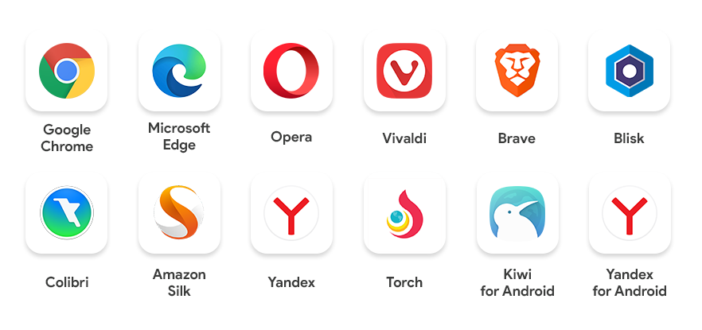

  

## Avro (অভ্র) for Microsoft Edge . Write Bangla instantly.

  

Avro (অভ্র) extension

for Microsoft Edge works with any chromium based browser that supports installing extensions from chrome web store.

  

---

  

 

  

  

---

  

## Features:

  

  

- It works **offline**.
- It's **fast and instant**, there is no round trip delay for processing every word you type.
- Save up to **"5 Draft Items"** for later use. 
- Introducing iconic **"Avro Font Fixer"**. Now you can apply default bangla font and fix bangla font problem in Microsoft Edge. 
- It values privacy. Whatever you write or save in the drafts don't leave your browser unless you want them to.
- Drafts are only saved locally on your machine and not being sent anywhere. 
- It doesn’t collect any of your personal info, including your IP address. even no analytics code  has been put in the code explicitly. 
- It's open source. Google deprecated its transliteration API service on May 26, 2011, and it may not be available after 3 years since the announcement. As a developer, you are free to integrate Avro (অভ্র) for Microsoft Edge in your application under the terms of MPL 2.0. We hate vendor locking as much as you do.

  

  

## Contributors

  

- Sarim Khan

  

- Rifat Nabi

  

- Mehdi Hasan

  

- Tanbin Islam Siyam

  

- Salman Hossain Saif

  
## Supported Browsers

  

## License

  

Avro (অভ্র) for Microsoft Edge is licensed under Mozilla Public License 2.0 ("MPL"), an open source/free software license.

  

  

## Submit Issues

  

[Create Issues](https://github.com/saif71/avro-for-edge/issues)

  

  

## Github Repo

  

[https://github.com/saif71/avro-for-chromium/](https://github.com/saif71/avro-for-edge/)
